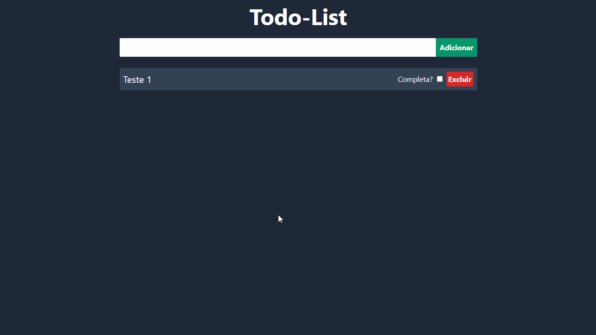

# Todo List - Redux

Aplicação web de lista de tarefas onde é possível adicionar, completar e excluir os itens.

## ✨ Preview

## 🛠 Builded with

##  About me

- 👤 Bacharel em jornalismo e atualmente estudante de Análise e Desenvolvimento de Sistemas, focado nas tecnologias relacionadas ao front-end, focado em ReactJS

- 🔭 Me encontre:  
